```mermaid
graph LR
    A[开始] --> B[处理]
    B --> C[结束]
```

<div align="center">


<h1>MD2Anything</h1>

<p><strong>Markdown is all you need</strong></p>

<p>一款优雅的 Markdown 转换工具，支持将 Markdown 内容转换为多种格式</p>

<p>
  <a href="#-功能特性">功能特性</a> •
  <a href="#-快速开始">快速开始</a> •
  <a href="#-使用指南">使用指南</a> •
  <a href="#-api-文档">API 文档</a> •
  <a href="#-技术文档">技术文档</a>
</p>

<p>
  
  
  
  
</p>

</div>

---

## ✨ 功能特性

### 🎯 多格式支持

| 格式 | 描述 | 导出方式 |
|------|------|----------|
| 微信 | 微信公众号文章 | 复制到剪贴板 |
| 小红书 | 小红书图文笔记 | 导出图片（支持多图） |
| 邮件 | 邮件通讯、简报 | 复制邮件HTML |
| 简历 | 专业简历文档 | 导出PDF |
| 通用 | 通用Markdown文档 | 图片/PDF/HTML |

### 🎨 丰富模板

- **微信模板**（8款）：技术文章、情感故事、新闻资讯、产品介绍、教程指南、商务报告、生活分享、暗夜模式
- **小红书模板**（6款）：清新简约、甜美粉色、活力橙黄、自然清新、梦幻紫韵、暗黑高级
- **邮件模板**（2款）：商务简约、新闻简报
- **简历模板**（5款）：经典专业、极简灰调、优雅墨绿、暖橙活力、典雅紫韵
- **通用模板**（2款）：现代简约、GitHub风格

### ⚙️ 自定义设置

- **字体大小** - 12px ~ 24px 可调
- **边距** - 0px ~ 96px 可调
- **背景颜色** - 16 种预设颜色 + 自定义

### 📝 增强编辑

- **拖拽上传** - 直接拖入 `.md` / `.txt` 文件
- **字数统计** - 实时显示字数、行数、预估阅读时间
- **工具栏** - 快速插入标题、粗体、斜体、链接、图片、表格等

### 🔧 增强渲染

- **代码高亮** - Prism.js 语法高亮，支持 20+ 种语言
- **数学公式** - KaTeX 支持，行内 `$...$` 和块级 `$$...$$`
- **Mermaid 图表** - 流程图、时序图、甘特图、饼图等

### 🔧 其他功能

- 📝 实时预览 - 编辑器与预览区同步滚动
- 💾 历史记录 - 自动保存，最多保留 10 条
- 📋 示例内容 - 每种格式都有对应示例

---

## 🚀 快速开始

### 在线使用

直接访问部署的网站即可使用。

### 本地运行

```bash
# 克隆项目
git clone https://github.com/Freakz3z/MD2Anything.git
cd MD2Anything

# 安装依赖
npm install

# 启动开发服务器
npm run dev

# 构建生产版本
npm run build

# 启动 API 服务
npm run server
```

### 快速开发模板

如果你使用 Claude Code，可以使用内置 Skill 快速创建模板：

```
/create-template
```

这个 Skill 会通过交互式问答自动生成模板代码。

详细指南请阅读 [CONTRIBUTING.md](CONTRIBUTING.md)。

---

## 📖 使用指南

### 代码语法高亮

支持 20+ 种编程语言，使用标准 Markdown 代码块语法：

````markdown
```javascript
const greeting = "Hello, World!";
console.log(greeting);
```
````

支持的语言：JavaScript, TypeScript, Python, Java, C, C++, C#, Go, Rust, Bash, JSON, YAML, SQL, Docker, Nginx 等。

### 数学公式

使用 KaTeX 渲染数学公式：

**行内公式**：`$E = mc^2$` → $E = mc^2$

**块级公式**：
```
$$
\sum_{i=1}^{n} x_i = x_1 + x_2 + \cdots + x_n
$$
```

### Mermaid 图表

使用 Mermaid 语法绘制图表：

````markdown

````

支持：流程图、时序图、甘特图、饼图、类图、状态图等。

---

## 🔌 API 文档

MD2Anything 提供了 RESTful API，可以程序化调用转换功能。

### 启动 API 服务

```bash
npm run server
```

服务默认运行在 `http://localhost:3001`

### 可用端点

| 端点 | 方法 | 描述 |
|------|------|------|
| `/health` | GET | 健康检查 |
| `/api/convert/html` | POST | 转换为带样式的 HTML |
| `/api/convert/email` | POST | 转换为邮件兼容 HTML |
| `/api/convert/wechat` | POST | 转换为微信兼容 HTML |
| `/api/convert/plain` | POST | 转换为纯 HTML |
| `/api/convert/templates` | GET | 获取所有模板列表 |

### 请求示例

```bash
curl -X POST http://localhost:3001/api/convert/html \
  -H "Content-Type: application/json" \
  -d '{"markdown": "# 标题", "templateId": "general-modern"}'
```

### 请求参数

| 参数 | 类型 | 必填 | 描述 |
|------|------|------|------|
| markdown | string | ✅ | Markdown 文本 |
| templateId | string | ❌ | 模板 ID |
| fontSize | number | ❌ | 字体大小，默认 16 |
| margin | number | ❌ | 边距，默认 24 |
| backgroundColor | string | ❌ | 背景颜色，默认 #ffffff |

📖 详细 API 文档请查看 [docs/API.md](docs/API.md)

---

## 📚 技术文档

| 文档 | 描述 |
|------|------|
| [CONTRIBUTING.md](CONTRIBUTING.md) | 贡献指南 - 如何开发新模板 |
| [docs/ARCHITECTURE.md](docs/ARCHITECTURE.md) | 架构设计文档 |
| [docs/TEMPLATE_DEVELOPMENT.md](docs/TEMPLATE_DEVELOPMENT.md) | 模板开发详细指南 |
| [docs/API.md](docs/API.md) | API 接口详细文档 |

---

## 🛠️ 技术栈

- **框架**: React 19 + TypeScript
- **构建工具**: Vite 7
- **UI 组件**: Ant Design 6
- **状态管理**: Zustand
- **Markdown 解析**: marked
- **代码高亮**: Prism.js
- **数学公式**: KaTeX
- **图表渲染**: Mermaid
- **导出功能**: html2canvas + jsPDF
- **API 服务**: Express.js

---

## 📁 项目结构

```
MD2Anything/
├── src/                    # 前端源码
│   ├── components/         # React 组件
│   ├── templates/          # 模板配置
│   ├── utils/              # 工具函数
│   │   ├── enhancedMarkdown.ts  # 增强 Markdown 解析
│   │   ├── stats.ts             # 字数统计
│   │   └── export/              # 导出功能
│   ├── store/              # 状态管理
│   └── types/              # TypeScript 类型
├── server/                 # API 服务
│   ├── routes/             # API 路由
│   ├── utils/              # 服务端工具
│   └── templates.ts        # 服务端模板
├── docs/                   # 技术文档
└── public/                 # 静态资源
```

---

## 🤝 参与贡献

我们欢迎所有形式的贡献！

- 🐛 提交 Issue 报告 Bug 或提出新功能建议
- 💡 提交 Pull Request 贡献代码
- 📝 完善文档
- 🎨 开发新模板

---

## 📄 许可证

本项目基于 [MIT](LICENSE) 许可证开源。
